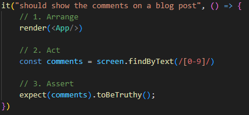
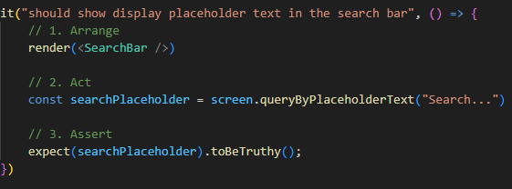
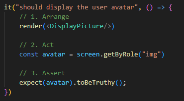
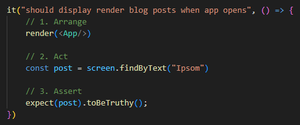
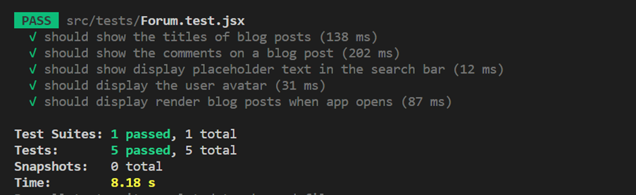
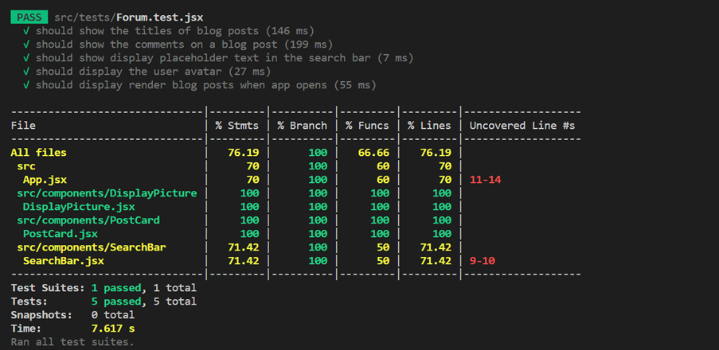

# **Post-it - Messaging Forum** 📝

## **_Collaborators_** ⭐

- Gulseren Ozdemir (GitHub: [GulserenOzdemir](https://github.com/GulOzdemir3))
- Connel Nwaodor (GitHub: [ConnelNwaodor](https://github.com/Connz17))
- Jason Moffat (GitHub: [JasonMoffat](https://github.com/jasonmoffat99))
- Rimm Deres (GitHub: [RimmDeres](https://github.com/rimmderes))

## **Project Overview** 🚀

Our team took inspiration from discussion platforms like Reddit and Quora for our full-stack application, which enables users to explore various spaces and topics of their interest, post content, give likes, and comment. Logged-in users have greater privileges and can engage more with other users than non-logged-in users, who are presented with a limited page.

### **_Methodology_** 🔌

We have been used Scrum for this project. Reason we have chosen this as it is based on good communication, collaboration between team members and stakeholders. Also, the ability to be flexible and respond quickly to change. The basic building blocks of Agile development are iterations: Each one of them includes planning, analysis, design, development, and testing.

For versional control, we have used GitHub

### **_Roles and responsibilities_** 🎉

Everyone has contributed equally, making sure when we distributed the work, everyone was comfortable with the work they were given and were given the needed support when needed to meet our end goal.

### **_Purpose_** 💎

We are building this product to showcase our skills we have acquired through our own projects or through the bootcamp. The project is a messaging forum where users are able to create an account and post message threads and other signed-up users can interact with that message thread, like comments/posts, comment on other users posts, reply to comments delete and update comments. Be able to use the CRUD operations.

 

### **_Project Timeline_** 💡

> - Week 1: Developed frontend using Javascript React, HTML and CSS.

#### **_Wireframe_**

Our wireframe shows the landing page for a user who does not have an account with us. Beginning design without the additional pages.

Our first page to reflect our wireframe.

**_HTML_**

We used HTML to populate the text on the page

**_CSS_**

We designed our page utilising selectors to manipulate the page and text, making declarations to assign values to properties. For instance, grid, flex, border radius and more.

 

**_Javascript_**

We used the fetch function to replace HTML standard data with data populated in a json file.

 

#### **_Components Diagram_**

 

## **Requirements**:

### **_Functional requirements_**:

- User can sign into their account.
- User can sign-up and create an account.
- All users can view posts.
- Signed-in user can access all posts.
- Signed-in user can post and delete messages.
- Signed-in user can update messages.
- User can click button to submit post.
- Users can reply to post comments.
- Users can delete message.
- Users can delete comment.
- Users can delete their likes.
- Users can delete other users’ comments on their posts.
- Users can update posts.
- Users can update comments

Non-functional requirements:

- Page uploads in less than 3 seconds.
- Page reloads in less than 5 seconds.

 

## **Testing** 🧪

We ran some tests using the react-testing-library, simulating a range of scenarios on how the user will interact with the application:

<!-- | TEST SCENARIO 1: Should show the titles of blog posts |
| Explanation | Code | Result | 
| :---:   | :---: | :---: | 
| In this test, the expectation is for the user to be able to see the title of each blogpost as they enter the Home page.

We create a constant ‘postTitle’ that uses the ‘getByText’ method  to see if the if the title is on screen.
 | Display all events | -->

### **TEST SCENARIO 1: Should show the titles of blog posts**

In this test, the expectation is for the user to be able to see the title of each blogpost as they enter the Home page.

We create a constant ‘postTitle’ that uses the ‘getByText’ method to see if the if the title is on screen.

<imr src= "test_scenario_1.png">

The test had shown that the user was successfully able to see the titles of each blogpost.

### **TEST SCENARIO 2: Should show the number of comments on a blog post**

In this test, the expectation is for the user to be able to see the number of comments on screen.

The constant ‘comments’ uses the ‘findByText’ method to find the comments on each blog post.

We expect to see these comments using the ‘toBeTruthy()’ method.

The test successfully shows that the user can see the comments on each post.

### **TEST SCENARIO 3: Should display the placeholder in the search bar**

In this test, the expectation is for the user to be able to see the placeholder text “Search” in the search bar.

The test then scans the screen to see if the placeholder text is present.

### **TEST SCENARIO 4: Should display the user avatar**

In this test, the expectation is for the user to be able to see ‘DisplayPicture’.

The test using the constant ‘avatar’ scans the screen to check if a ‘img’ is present.

We then expect the ‘avatar’ to be visible with the method ‘toBeTruthy()’.

### **TEST SCENARIO 5: Should display render blog posts when the app opens**

In this test, the expectation is for the user to be able to see the rendered blog posts on the page when entering the application.

Using the constant ‘post’, the test scans the screen and checks to see the text “Ipsom”.

We then expect the ‘post’ to be visible with the method ‘toBeTruthy()’

### **TEST ANALYTICS**

All 5 tests were successful, the results are displayed below:

 

### **_Dependencies_** ⚓

- This project was bootstrapped with Create React App. After cloning the react app, make sure you download the necessary modules
- **npm i - to install node modules**
- **npm install react-router-dom@6 - to install react router**
- **npm install --save-dev @testing-library/react**
- **npm install react-icons --save**
- **npm install react-router-dom**
- **npm install sass --save-dev**
- **npm install gh-pages --save-dev**

 

### **_Installation_** 💃

- Firstly, you need to install the backend project in order to run the code successfully. This is done by cloning the backend git repo using the command: git clone …
- You will then need to run this application before moving on the next steps in the frontend.
- In the project directory, you can run: npm start
- This will run the app in the development mode. And you can open (http://localhost:3000) to view it in your browser.

 

# **ENJOY USING OUR API**! 👾
